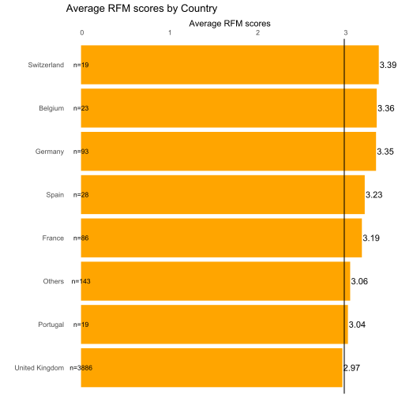
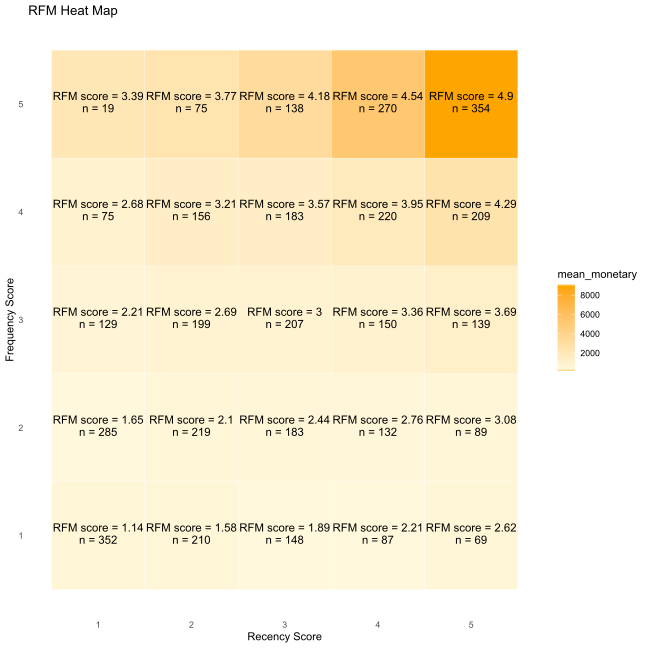
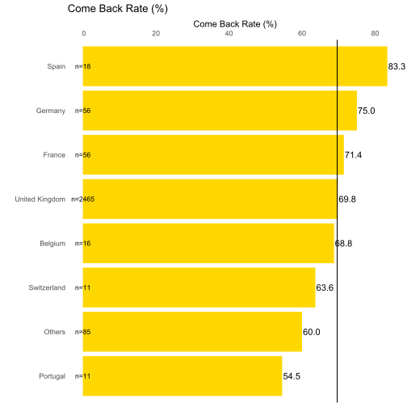
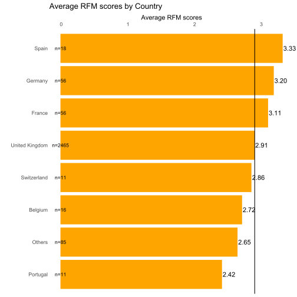
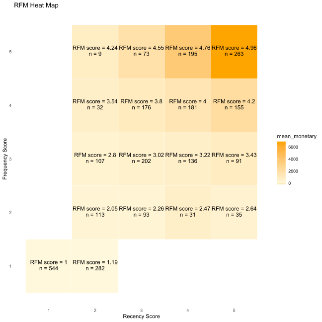
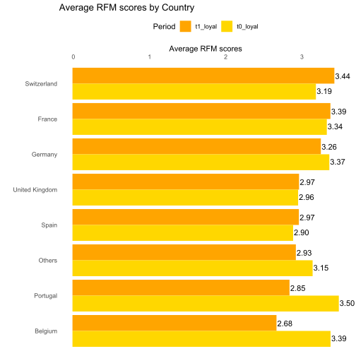
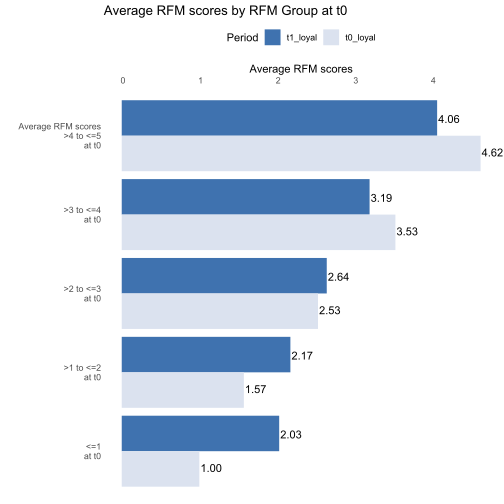

Note: If you are interested in SAS instead, please click [here](https://github.com/maxleungtszchun/customerAnalytics_SAS) to read Customer Analytics in SAS. If you are interested in R, please continue reading.

# Customer Analytics in R
This package's RFM function uses independent binning and assigns ties to the same bin. [IBM](https://www.ibm.com/support/knowledgecenter/en/SSLVMB_24.0.0/spss/rfm/idh_rfm_binning_transactions.html) provides a detail explanation of both methods.

## Installation
```R
install.packages("devtools") # this line can be skipped if you have already installed devtools
devtools::install_github("maxleungtszchun/customerAnalytics")

# During installation, you can choose to update other packages.
# If there is a warning "cannot remove prior installation of package 'package name'" when updating packages,
# please reinstall those packages with install.packages('package name').
# If the warning still exists, just skip the update of those packages.

# removeDup() in this package depends on count_if() from expss. However, the new version (0.9.0) of expss
# made some updates which made the count_if() perform very slowly.
# if you encounter performance issue when using removeDup(), try to reinstall expss with earlier version (0.8.11):
# devtools::install_version("expss", version = "0.8.11", repos = "https://cran.r-project.org")
# and then restart R again (very important!).

# the installation of this package requires R version >= 3.5.1
```
## Three Examples
Note: The following examples additionally require installing the package of tidyverse.
## 1. RFM Analysis
In this analysis, the RFM scores of customers during period 0 and 1 are calculated by using period 0 and 1 transaction data.
Click [here](https://drive.google.com/file/d/1G6AeKId11lOupRLLzFJYVO-6qRNrESMH/view?usp=sharing) to see the same results calculated by using Excel. You may ask why bother using R? 1. Excel can not handle data having more than 1,048,576 rows. For the dataset in this example, it is okay to use Excel. However, if you have other datasets that have more than 1 million rows, using R is a better choice; 2. If the same process is going to be performed repeatedly, using R is a better choice.

Actionable Recommendation:  
Marketing resoucres (e.g. promotion resources) can be allocated to the customers that have higher RFM scores in order to optimize response rates.
```R
library(customerAnalytics)
library(tidyverse)

# one customer ID may have more than one country
# only the latest country is kept

# Dataset used in these examples seem to be duplicated (<1% of total). However, it is quite difficult
# to judge whether those records are really duplicated since records with same InvoiceNo can have same
# StockCode with different Quantity. As a result, records with same InvoiceNo, same StockCode and same
# Quantity may also be correct. Due to this consideration, all those potential duplicated records are
# kept in the analysis.

customer_data <-
  customer_data_t0 %>%
  bind_rows(customer_data_t1) %>%
  group_by(CustomerID) %>%
  summarize(Country = last(Country))

transaction_data <-
  transaction_data_t0 %>%
  bind_rows(transaction_data_t1)

# equal weights are specified here,
# weights estimated from Generalized Linear Model will be used in the next example.
equalWeights <- c("r" = 1/3, "f" = 1/3, "m" = 1/3)

whole <-
  getRfmTable(customer_data, transaction_data, CustomerID,
              InvoiceDate, revenue) %>%
  getRfmScore(r_score, f_score, m_score,
              equalWeights, "r", "f", "m") %>%
  left_join(customer_data, by = "CustomerID")

ppp1 <- plotGroupBars(whole, Country, rfm_score,
                      title = "Average RFM scores by Country",
                      label = "Average RFM scores", dp = 2, fill = "orange")
ppp2 <- plotHeatMap(whole, r_score, f_score, monetary, rfm_score)

print(ppp1)
print(ppp2)
```



## 2. Retention Analysis and RFM scores in the next period
This analysis selects a group of customers during period 0 and shows how many of them return during period 1. It also shows the Recency, Frequency and Monetary (RFM) scores of those customers during period 0 calculated by using period 1 transaction data. Click [here](https://drive.google.com/file/d/1j5gnCJydKPd-59-zUrQ4-BQgNcDSENXA/view?usp=sharing) to see the same results calculated by using Excel. 

The RFM scores capture the information of come back rate as "do not return" customers have lower recency scores (or higher recency values), zero frequency and zero monetary values. Thus, the RFM scores here offer richer information compared with come back rate.  

This analysis includes customers during period 0 who do not return during period 1. The RFM scores calculated here should not be compared with RFM scores calculated by using period 0 transaction data. If you need to compare RFM scores for the same group of customers over time, please read the next example: RFM Migration Analysis.  

Actionable Recommendation:  
If come back rate or RFM score here is significantly lower than some benchmarks such as targets, a detail investigation of the underlying reasons is needed. There may be a potential to improve.
```R
library(customerAnalytics)
library(tidyverse)

# get Recency scores, Frequency scores and Monetary scores of customers who visited during period 0 by
# using transaction records during period 0. 
t0 <- getRfmTable(customer_data_t0, transaction_data_t0, CustomerID,
                  InvoiceDate, revenue)
				  
# get Recency scores, Frequency scores and Monetary scores of customers who visited during period 0 by
# using transaction records during period 1.
t1 <- getRfmTable(customer_data_t0, transaction_data_t1, CustomerID,
                  InvoiceDate, revenue,
                  cData_visitDate = visitDate)

t <-
  t0 %>%
  left_join(t1, by = "CustomerID")

# Logistic Regression is applied here as the dependent variable is the "come back" indicator during period 1
# while independent variables are standardized RFM values (not scores) during period 0.
logitWeights <- getRfmWeights(t, return.y ~ negative_r_zScore.x + f_zScore.x + m_zScore.x)

# if the dependent variable is the frequency of visit (count variable) during period 1,
# Poisson regression should be applied.
poissonWeights <- getRfmWeights(t, frequency.y ~ negative_r_zScore.x + f_zScore.x + m_zScore.x,
                                family = "poisson")

final <- getRfmScore(t1, r_score, f_score, m_score,
                     logitWeights[[1]], "negative_r_zScore.x_weight",
                     "f_zScore.x_weight", "m_zScore.x_weight")

final %<>%
  left_join(customer_data_t0, by = "CustomerID") %>%
  select(-visitDate)

p1 <- plotGroupBars(final, Country, rfm_score,
                    title = "Average RFM scores by Country",
                    label = "Average RFM scores", dp = 2, fill = "orange")
p2 <- plotGroupBars(final, Country, recency,
                    title = "Average Recency (Days) By Country",
                    label = "Average Recency (Days)", fill = "pink")
p3 <- plotGroupBars(final, Country, frequency,
                    title = "Average Frequency (Times) By Country",
                    label = "Average Frequency (Times)", fill = "light green")
p4 <- plotGroupBars(final, Country, monetary,
                    title = "Average Monetary (Sterling) By Country",
                    label = "Average Monetary (Sterling)", fill = "light blue")
p5 <- plotGroupBars(final, Country, return,
                    title = "Number of Return Customers",
                    label = "Return Customers",
                    sum, dp = 0, fill = "grey", mean_line = FALSE)
p6 <- plotGroupBars(final, Country, return * 100,
                    title = "Come Back Rate (%)",
                    label = "Come Back Rate (%)", fill = "gold")
p7 <- plotHeatMap(final, r_score, f_score, monetary, rfm_score)

print(p6)
print(p1)
print(p7)
```



Independent binning, instead of nested binning, is applied. Thus, the number of customers in each RFM cell are different.


Other charts can be found [here](./svg).

The regression results can also be verified by using STATA. First, click [here](https://drive.google.com/file/d/1bAEjvkXwPLCd647HLRNsE13YXRKN9_cb/view?usp=sharing) to download the dataset.
Second, change the path to your file location and run the following STATA commands.
```STATA
insheet using "\regression_data.csv", comma

glm return_1 n_r_s f_s m_s, family(binomial 1) link(logit)
glm f_1 n_r_s f_s m_s, family(poisson) link(log)
```

## 3. RFM Migration Analysis
Following [Arthur Hughes](https://www.dbmarketing.com/articles/Art123.htm), only customers who visited during both period 0 and period 1 are kept in this RFM Migration Analysis.  

Those loyal customers are grouped by country or their weighted RFM scores during period 0. The variable "logitWeights" was calculated in the previous example.
```R
library(customerAnalytics)
library(tidyverse)

customer_data_t0_loyal <-
  customer_data_t0 %>%
  inner_join(customer_data_t1, by = "CustomerID") %>%
  select(-visitDate.y, -Country.y)

t0_loyal <- getRfmTable(customer_data_t0_loyal, transaction_data_t0, CustomerID,
                        InvoiceDate, revenue) %>%
              getRfmScore(r_score, f_score, m_score,
                          logitWeights[[1]], "negative_r_zScore.x_weight",
                          "f_zScore.x_weight", "m_zScore.x_weight") %<>%
              left_join(customer_data_t0_loyal[c("CustomerID", "Country.x")], by = "CustomerID") %>%
              mutate(rfm_group = if_else(rfm_score <= 1, "<=1\nat t0",
                                         if_else(rfm_score <= 2, ">1 to <=2\nat t0",
                                                 if_else(rfm_score <= 3, ">2 to <=3\nat t0",
                                                         if_else(rfm_score <= 4, ">3 to <=4\nat t0",
                                                                 "Average RFM scores\n>4 to <=5\nat t0")))),
                     period = "t0_loyal")

t1_loyal <- getRfmTable(customer_data_t0_loyal, transaction_data_t1, CustomerID,
                        InvoiceDate, revenue) %>%
              getRfmScore(r_score, f_score, m_score,
                          logitWeights[[1]], "negative_r_zScore.x_weight",
                          "f_zScore.x_weight", "m_zScore.x_weight") %<>%
              left_join(customer_data_t0_loyal[c("CustomerID", "Country.x")], by = "CustomerID") %>%
              left_join(t0_loyal[c("CustomerID", "rfm_group")], by = "CustomerID") %>%
              mutate(period = "t1_loyal")

loyal <-
  t0_loyal %>%
  bind_rows(t1_loyal)

pp1 <- plotPeriodGroupBars(loyal, Country.x, rfm_score, period,
                           sortFirst = "t1_loyal",
                           title = "Average RFM scores by Country",
                           label = "Average RFM scores",
                           legendTitle = "Period", dp = 2)

pp2 <- plotPeriodGroupBars(loyal, rfm_group, rfm_score, period,
                           sortFirst = "t1_loyal",
                           title = "Average RFM scores by RFM Group at t0",
                           label = "Average RFM scores",
                           legendTitle = "Period", dp = 2,
                           colorVector = c("#dbe2ef", "#3f72af"))

print(pp1)
print(pp2)
```


